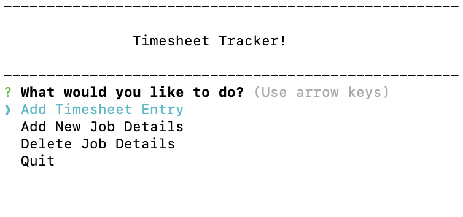

# Timesheet Tracker

## Why I Built This?

In my role i have to track my work hourly and note which client i am working for at the time. In order to make sure the timesheets are correct and accurate i created this program that would store job details and create a csv that would contain all my timesheet info.

## Install Instructions

```
npm i
```

## Running Program

```
node index.js
```

## Program instruction

### General Use

Program will give the user three options:
1. Create Timesheet Entry
2. Add new job details to be remembered
3. Delete job details if they are no longer needed

### Notes

Reviewing the timesheet.csv will contain all timesheet entries that have been input. It will also be dated with date and time. 

## Screenshot



## Program Information

### Package Used

1. Inquirer
